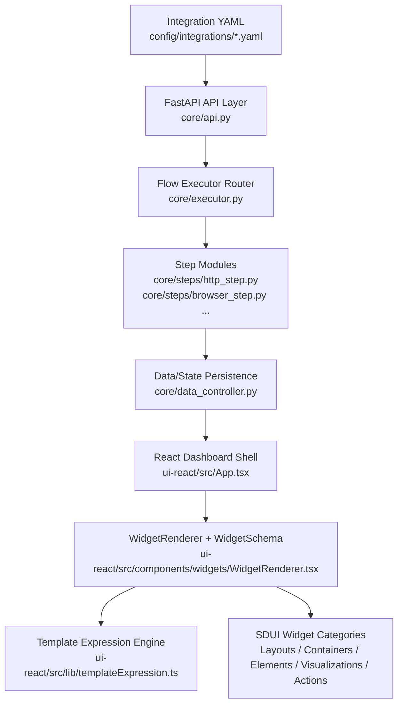

# Architecture - Glancier

**Analysis Date:** 2026-03-10

## Pattern Overview

**Overall:** Configuration-driven **Personal Data Aggregator & Hub** with a Bento Grid UI.

**Key Characteristics:**
- **Flow -> Bento Grid Pipeline**: Integration behavior is declared as a `flow` in YAML (`config/integrations/*.yaml`) and visualized using View Templates.
- **Decoupled Data Fetching**: Data is treated as generic **Integration Data**, categorized into **Metrics** (numeric) or **Signals** (state/boolean).
- **Desktop-First Execution**: A modular monolith backend (FastAPI) wrapped in a Tauri shell for native scraping and local-first persistence.
- **SDUI Runtime Contract**: Rendering is schema-validated at runtime with Zod and driven by a safe template expression engine.

## Layers

**Configuration Layer:**
- Purpose: Define integration flows, auth strategies, and **Bento Card** templates.
- Location: `config/integrations/*.yaml`, `core/config_loader.py`
- Contains: Pydantic enums/models (`AuthType`, `StepType`, `SourceConfig`, `IntegrationConfig`)
- Used by: `main.py`, `core/api.py`, `core/auth/manager.py`, `core/executor.py`

**Execution Layer (The Flow Engine):**
- Purpose: Execute multi-step flows to extract **Integration Data**.
- Location: `core/executor.py`, `core/steps/*.py`, `core/source_state.py`
- Contains: Step routing + modular runners (`http`, `oauth`, `extract`, `script`, `webview`) and interaction handling.
- Depends on: `core/secrets_controller.py`, `core/data_controller.py`, `httpx`, `jsonpath_ng`

**Persistence Layer (Local-First):**
- Purpose: Store Metrics, Signals, configurations, and encrypted secrets locally.
- Location: `core/resource_manager.py`, `core/data_controller.py`, `core/secrets_controller.py`, `core/settings_manager.py`
- Contains: JSON file CRUD + TinyDB state/history + AES-256-GCM secret support.
- Environment Variable: `GLANCIER_DATA_DIR`.

**API Layer:**
- Purpose: Expose data hub capabilities to the client.
- Location: `main.py`, `core/api.py`
- Contains: `/api/sources`, `/api/data`, `/api/refresh`, `/api/integrations/files`.

**Presentation Layer (Bento UI):**
- Purpose: Render a high-density dashboard using modular **Micro-Widgets**.
- Location: `ui-react/src/App.tsx`, `ui-react/src/pages/*.tsx`, `ui-react/src/components/**/*`
- Philosophy: **Bento Grid** - Organized, modular tiles displaying prioritized data.
- Components:
  - SDUI renderer core: `ui-react/src/components/widgets/WidgetRenderer.tsx`
  - Layouts: `Container`, `ColumnSet`, `Column`
  - Containers: `List` (filter/sort/limit/pagination)
  - Elements: `TextBlock`, `FactSet`, `Image`, `Badge`
  - Visualizations/Actions: `Progress`, `ActionSet`, `Action.OpenUrl`, `Action.Copy`
  - Template engine: `ui-react/src/lib/templateExpression.ts`, `ui-react/src/lib/utils.ts`

## Project Architecture Diagram

**Desktop Bridge Layer:**
- Purpose: Provide native autostart and webview scraping workflows
- Location: `ui-react/src-tauri/src/lib.rs`, `ui-react/src-tauri/src/scraper.rs`
- Contains: tauri command handlers, event emitters, hidden/off-screen scraper window orchestration
- Depends on: Tauri plugins and frontend `invoke/listen` calls in `ui-react/src/App.tsx` and `ui-react/src/pages/Settings.tsx`
- Used by: React client when run as desktop app

## Data Flow

**User-Driven Refresh Flow:**

1. UI triggers refresh via `api.refreshSource` or `api.refreshAll` in `ui-react/src/api/client.ts`
2. FastAPI route in `core/api.py` resolves `StoredSource` to `SourceConfig` and schedules `Executor.fetch_source`
3. Executor runs configured steps in `core/executor.py`, obtaining secrets from `core/secrets_controller.py`
4. Results and status are persisted to TinyDB (`core/data_controller.py`) and returned to UI polling (`ui-react/src/App.tsx`)

**SDUI Render Flow:**

1. View template config (including `{...}` expressions) is loaded by the frontend.
2. `WidgetRenderer` recursively evaluates template fields via `evaluateTemplate` / `evaluateTemplateExpression`.
3. Evaluated nodes are validated with `WidgetSchema.safeParse` (Zod runtime guard).
4. `List` nodes bind array data via `data_source`, then apply `filter`, `sort_by`, `limit`, and optional pagination.
5. Leaf widgets render typed props; invalid nodes degrade safely without blanking the whole card.

**State Management:**
- Backend runtime state: in-memory `Executor._states` plus persisted source status in TinyDB via `DataController.set_state` (`core/executor.py`, `core/data_controller.py`)
- Frontend state: React hooks in large page-level component `ui-react/src/App.tsx`; no global state library detected

## Key Abstractions

**Source and Integration Models:**
- Purpose: Contract between YAML definitions, persisted JSON source instances, and runtime execution
- Examples: `core/config_loader.py`, `core/models.py`
- Pattern: Pydantic-validated schema with merge/substitution resolution

**InteractionRequest Contract:**
- Purpose: Standardize actionable user prompts (API key, OAuth, webview scrape)
- Examples: `core/source_state.py`, `ui-react/src/components/auth/FlowHandler.tsx`
- Pattern: backend emits typed interaction payload; frontend renders dynamic form/actions

**Scraper Task Bridge:**
- Purpose: Offload web dashboard scraping through Tauri webview interception
- Examples: `ui-react/src-tauri/src/scraper.rs`, `ui-react/src/App.tsx`
- Pattern: command dispatch (`invoke`) + emitted events (`listen`) + source-scoped dedupe

**Widget Runtime Contract:**
- Purpose: Keep declarative UI schema-first and AI-friendly while ensuring runtime safety.
- Examples: `ui-react/src/components/widgets/WidgetRenderer.tsx`, `ui-react/src/components/widgets/**`
- Pattern: discriminated-union schema + recursive rendering + invalid-node fallback.

**Template Expression Engine:**
- Purpose: Evaluate template expressions with controlled syntax and helper whitelist.
- Examples: `ui-react/src/lib/templateExpression.ts`, `docs/sdui/03_template_expression_spec.md`
- Pattern: custom parser/evaluator, no `eval/new Function`, forbidden prototype-chain access.

## Entry Points

**Backend Entry Point:**
- Location: `main.py`
- Triggers: `python main.py [port]`
- Responsibilities: initialize services, wire API dependencies, startup refresh lifecycle, run uvicorn

**Frontend Entry Point:**
- Location: `ui-react/src/main.tsx`
- Triggers: Vite app start (`npm run dev`)
- Responsibilities: mount React tree, apply `ThemeProvider`, render router app

**Desktop Entry Point:**
- Location: `ui-react/src-tauri/src/main.rs` -> `ui-react/src-tauri/src/lib.rs`
- Triggers: `npm run tauri:dev` / Tauri bundle launch
- Responsibilities: register native commands, optional sidecar startup, manage scraper state

## Error Handling

**Strategy:** Catch-and-convert with user-facing interactions or HTTP errors

**Patterns:**
- Backend uses `try/except` + `logger.error` and maps failures to `SourceStatus` + `InteractionRequest` in `core/executor.py`
- API routes validate presence/IDs and raise `HTTPException` in `core/api.py`

## Cross-Cutting Concerns

**Logging:** Python logging configured in `main.py`; module loggers throughout `core/*.py`; console logging on frontend in `ui-react/src/App.tsx`
**Validation:** Pydantic model validation in `core/config_loader.py`, `core/models.py`, `core/source_state.py`; Zod runtime validation for SDUI widgets in `ui-react/src/components/widgets/WidgetRenderer.tsx`
**Authentication:** Source-scoped auth handlers (`api_key`, `oauth`, `browser`) in `core/auth/*.py` with secret persistence in `core/secrets_controller.py`

---

*Architecture analysis: 2026-03-10*
