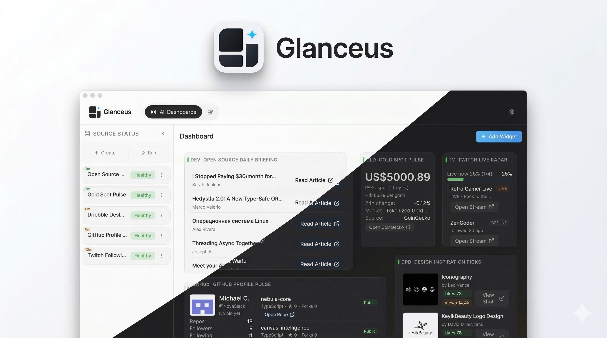

<p align="center">
  
</p>

<h1 align="center">Glanceus</h1>

<p align="center"><strong>AI-friendly, config-first personal data hub for Metrics, Signals, Integration Data, and Bento Cards.</strong></p>
<p align="center">Define integrations in YAML and run <code>auth -&gt; fetch -&gt; parse -&gt; render</code> without hardcoding new platform logic in Python.</p>

<p align="center">
  
</p>
<p align="center"><a href="#quick-start">Quick Start</a> · <a href="#product-highlights">Highlights</a> · <a href="#documentation-map">Docs</a></p>

## Product Highlights

- **Built for AI-assisted workflows**: Integration authoring and maintenance follow structured, machine-friendly YAML and docs.
- **Config-first execution model**: Move from auth to render through declarative steps instead of custom platform code.
- **Declarative UI with SDUI**: Templates define cards and widgets, while backend owns workflow/auth/state boundaries.
- **OAuth-first + API key compatible**: Supports Code + PKCE, Device Flow, and Client Credentials with pragmatic fallback options.
- **Optional script sandbox (Beta)**: High-risk script behavior may be blocked by sandbox policy for safer execution.
- **Local-first runtime**: Integration data, source configs, and secrets stay on your machine by default.
- **Desktop scraping fallback**: WebView Scraper handles platforms without stable public APIs.
- **Bento dashboard layout**: Flexible composition for Signals and Metrics in one glance.
- **Dual-mode dashboard management**: Switch between single-view rendering and management mode for dashboard CRUD, reorder, and overflow operations.

## Quick Start

### 1. Install dependencies

```bash
pip install -r requirements.txt
pnpm --dir ui-react install
```

### 2. Run in development

```bash
make dev        # backend + web frontend
make dev-tauri  # backend + Tauri desktop shell
```

### 3. Configure integrations

- Open the Integrations page in UI.
- Create or edit YAML files under `config/integrations/`.
- Reload integration definitions via API/UI when needed.

### 4. Use the canonical AI authoring path

- Use `skills/integration-editor` as the canonical integration YAML authoring path.
- `skills/PROMPT.md` is the single-file convenience prompt aggregated from the integration-editor skill sources.
- When prompt or fallback behavior changes, update root docs and phase acceptance artifacts in the same delivery.

## Developer & Maintainer Quick Reference

### Quick start (dependencies)

```bash
pip install -r requirements.txt
pnpm --dir ui-react install
```

### Core commands

| Command | Purpose |
| --- | --- |
| `make help` | List canonical project commands |
| `make dev` | Run backend + web frontend |
| `make dev-tauri` | Run backend + Tauri app |
| `make build-backend` | Build Python sidecar artifacts |
| `make build-mac` | Build macOS arm64 desktop package (.dmg) |
| `make build-win` | Build Windows x64 desktop package (.exe) |
| `make test-backend` | Backend core test gate |
| `make test-frontend` | Frontend core test gate |
| `make test-typecheck` | Frontend tests + TypeScript gate |
| `make test-impacted` | Changed-file driven gate |
| `make gen-schemas` | Generate schema artifacts |

### Desktop release CI (GitHub Actions)

- Workflow: `.github/workflows/ci.yml` -> `release-tauri` (manual `workflow_dispatch` only).
- Matrix targets:
  - macOS Apple Silicon: `macos-15` / `aarch64-apple-darwin` / `.dmg`
  - macOS Intel: `macos-15-intel` / `x86_64-apple-darwin` / `.dmg`
  - Windows x64: `windows-latest` / `x86_64-pc-windows-msvc` / `.exe` (NSIS)
- Prebuild stage runs `bash scripts/build.sh --prepare-only` to stage sidecar archives before Tauri bundling.
- In-app updater artifacts are enabled (`createUpdaterArtifacts: true`) and signed during release build.
- Release upload includes updater archive + signature (`*.app.tar.gz`, `*.app.tar.gz.sig`) for updater downloads.
- `latest.json` is uploaded as updater metadata; if Tauri does not emit it directly, CI generates it from the produced updater archive/signature.
- Required GitHub repository secrets for signed updater artifacts:
  - `TAURI_SIGNING_PRIVATE_KEY`
  - `TAURI_SIGNING_PRIVATE_KEY_PASSWORD`

Generate signer keys locally (private key must stay secret):

```bash
cd ui-react
pnpm exec tauri signer generate --ci --write-keys src-tauri/gen/updater/tauri-update.key
```

### AI workflow in this project (GSD + TDD)

- **Planning/execution**: Use the GSD workflow (`gsd-*`) for scoped tasks, state tracking, and atomic delivery.
- **Quality model**: Follow TDD (`RED -> GREEN -> REFACTOR`) for backend/frontend core behavior changes.
- **Release gate**: Run impacted or core gates before merge (`make test-impacted`, or module-specific test gates).
- **Doc language policy**: Any document without an explicit language tag must be written/updated in English (including this file and `AGENTS.md`).

## Documentation Map

- Terminology: [`docs/terminology.md`](docs/terminology.md)
- Flow architecture: [`docs/flow/`](docs/flow/)
- Refresh scheduler + retry architecture: [`docs/flow/05_refresh_scheduler_and_retry.md`](docs/flow/05_refresh_scheduler_and_retry.md)
- SDUI architecture: [`docs/sdui/`](docs/sdui/)
- Frontend engineering guide: [`docs/frontend/01_engineering_guide.md`](docs/frontend/01_engineering_guide.md)
- UI design guidelines: [`docs/ui_design_guidelines.md`](docs/ui_design_guidelines.md)
- WebView scraper docs: [`docs/webview-scraper/`](docs/webview-scraper/)
- Testing/TDD policy: [`docs/testing_tdd.md`](docs/testing_tdd.md)
- Build path contract: [`docs/build-path-contract.md`](docs/build-path-contract.md)
- AI coding contract: [`AGENTS.md`](AGENTS.md)

## Known Limitations

- Desktop mode (Tauri) provides the full WebView scraping capability; pure web mode has runtime fallback constraints.
- The project is optimized for single-user local workflows, not multi-tenant SaaS collaboration.
- Some advanced integrations require manual OAuth/app registration with third-party providers.
