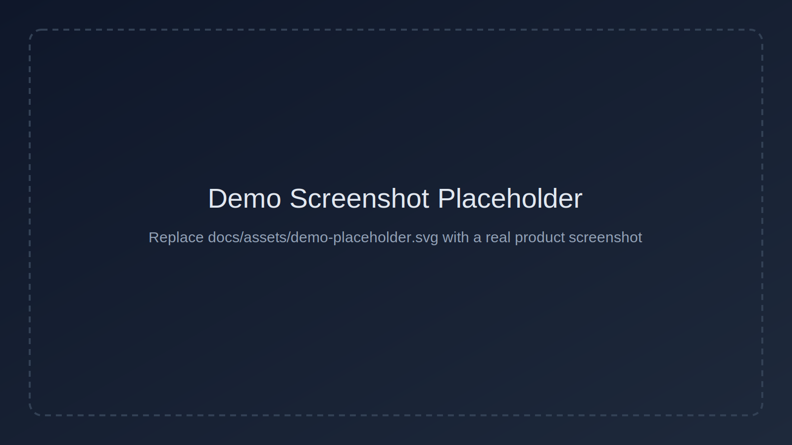

# Glancier

<p align="center">
  
</p>

<p align="center"><strong>Config-first personal data hub for metrics, signals, and automation workflows.</strong></p>

<!-- <p align="center">
  
</p>
<p align="center"><sub>Demo image placeholder. Replace with a real screenshot later.</sub></p> -->

## Features

- **AI-friendly**: Integration authoring and maintenance are optimized for AI-assisted workflows and structured docs.
- **Declarative UI**: SDUI templates define cards and widgets without hardcoding frontend business logic.
- **OAuth-first authentication**: Supports OAuth flows (Code + PKCE, Device Flow, Client Credentials), with API Key compatibility when needed.
- **Local-first**: Data, source configs, and secrets stay on your machine by default.
- **WebView Scraper**: Handles sites without stable APIs through interactive desktop scraping flow.
- **Free-layout dashboard**: Bento-style dashboard with flexible layout and widget composition.

## Usage

### 1. Install dependencies

```bash
pip install -r requirements.txt
npm --prefix ui-react install
```

### 2. Run in development

```bash
make dev        # backend + web frontend
make dev-tauri  # backend + Tauri desktop shell
```

### 3. Configure integrations

- Open the Integrations page in UI.
- Create or edit YAML files under `config/integrations/`.
- Reload integration definitions via API/UI when needed.

## Developer & Maintainer Quick Reference

### Quick start (dependencies)

```bash
pip install -r requirements.txt
npm --prefix ui-react install
```

### Core commands

| Command | Purpose |
| --- | --- |
| `make help` | List canonical project commands |
| `make dev` | Run backend + web frontend |
| `make dev-tauri` | Run backend + Tauri app |
| `make build-backend` | Build Python sidecar artifacts |
| `make build-mac` | Build macOS arm64 desktop package (.dmg) |
| `make build-win` | Build Windows x64 desktop package (.exe) |
| `make test-backend` | Backend core test gate |
| `make test-frontend` | Frontend core test gate |
| `make test-typecheck` | Frontend tests + TypeScript gate |
| `make test-impacted` | Changed-file driven gate |
| `make gen-schemas` | Generate schema artifacts |

### AI workflow in this project (GSD + TDD)

- **Planning/execution**: Use the GSD workflow (`gsd-*`) for scoped tasks, state tracking, and atomic delivery.
- **Quality model**: Follow TDD (`RED -> GREEN -> REFACTOR`) for backend/frontend core behavior changes.
- **Release gate**: Run impacted or core gates before merge (`make test-impacted`, or module-specific test gates).
- **Doc language policy**: Any document without an explicit language tag must be written/updated in English (including this file and `AGENTS.md`).

## Documentation Map

- Terminology: [`docs/terminology.md`](docs/terminology.md)
- Flow architecture: [`docs/flow/`](docs/flow/)
- SDUI architecture: [`docs/sdui/`](docs/sdui/)
- Frontend engineering guide: [`docs/frontend/01_engineering_guide.md`](docs/frontend/01_engineering_guide.md)
- WebView scraper docs: [`docs/webview-scraper/`](docs/webview-scraper/)
- Testing/TDD policy: [`docs/testing_tdd.md`](docs/testing_tdd.md)
- Build path contract: [`docs/build-path-contract.md`](docs/build-path-contract.md)
- AI coding contract: [`AGENTS.md`](AGENTS.md)

## Known Limitations

- Desktop mode (Tauri) provides the full WebView scraping capability; pure web mode has runtime fallback constraints.
- The project is optimized for single-user local workflows, not multi-tenant SaaS collaboration.
- Some advanced integrations require manual OAuth/app registration with third-party providers.
